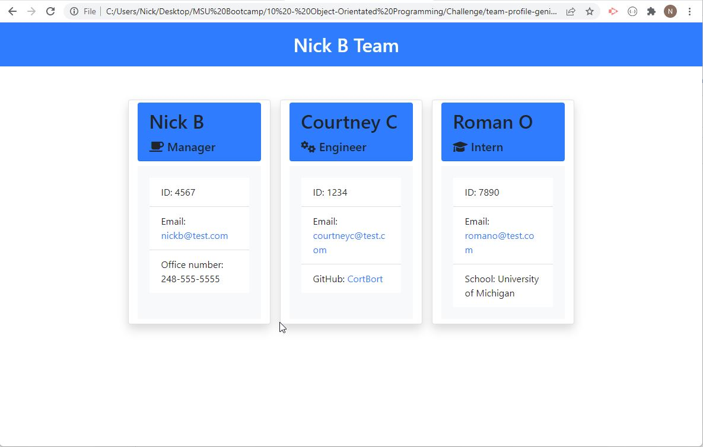

# Challenge 10: Team Profile Generator

## Description
Creates a team profile HTML page for your team that uses the following:

* Javascript
* HTML
* Bootstrap CSS
* Font Awesome
* Node.js
* Jest
* Inquirer

## Screenshot
</img>

## Video                    
https://watch.screencastify.com/v/kkt1mg5RVBFf3AlY3Dla
                                                                                       
## Installation
Navigate to the index.js file in Terminal and run it using node. 

## Usage
Creates a profile site for your team to used to display their information based on their role.

## Questions
Contact information for questions:  

Github: https://www.github.com/nickus1028  
Email: nick@test.com
